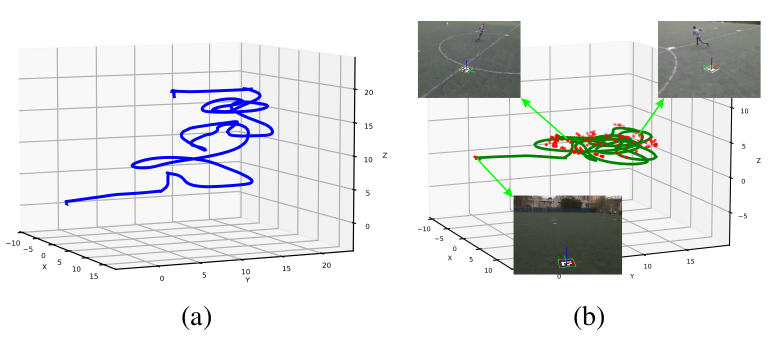
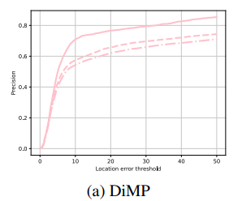
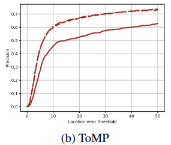
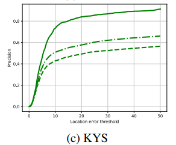
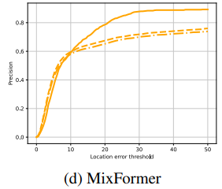
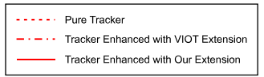

# pyTrackers
This repository contains implementation of some major correlation filter based trackers cloned from [pyCFTrackers](https://github.com/fengyang95/pyCFTrackers) repo and some deep learning trackers taken from [pytracking](https://github.com/fengyang95/pyCFTrackers). Modifications of their algorithms are made so that they can be benefit from camera state measurements. The algorithms are evaluated on a custom dataset named [VIOT dataset](https://drive.google.com/file/d/1xYHGJR-UWccPzbIuzMU_yf0bSkQ42qQh/view?usp=sharing). 


## Dataset
- Link to our dataset [this link](https://drive.google.com/file/d/1cXYGRWDcvpxmc54gyAqvfLYPxaSshgV9/view?usp=sharing) [VIOT-2 Database]
- This dataset was generated with [ground_truth_generation](https://github.com/hamidrezafahimi/ground_truth_generation) repository
 

### Sample images from dataset:
- Sample images from our VIOT-2 dataset
<br/>


<br/>


<br/>


<br/>


<br/>


### Sample odometry:
- Gradient-descent-optimization-based Correction of
robot’s visual odometry drift utilizing ArUco markers placed
in the field.


### sample result
- Tracker precision comparison over Mixformer and
KYS trackers for pure trackers, trackers enhanced with VIOT,
and trackers enhanced with our extension





<br/>



## Setup

### Running in Colab Notebook

A best experience is to run the code on a cloab notebook. For running the codes please use the Google Colab notebook found [here](https://colab.research.google.com/drive/1ZpzUCRHWSrblqPyaLZDdTCLPyjdEWUBm?usp=sharing).

### Running in Local System

To run the code in a local host, first clone the repository:

#### Prerequisites

Tested on the following platform:

```
ubuntu 20.04
pytorch 1.13.1
cuda 11.7
```

#### Create virtual environment:

Having *Anaconda* installed, try creating a new conda environment:

```
conda create --name pt python=3.7.2
```

Activate the environment before the rest of package installations and also run the codes with the environment activated.

#### Install prerequsites:

Do in order:

```
pip install torch==1.13.1 torchvision
pip install matplotlib
pip install utm
pip install visdom
export LD_LIBRARY_PATH=/usr/local/cuda-11.7/lib64:$LD_LIBRARY_PATH
export PATH=/usr/local/cuda-11.7/bin:$PATH
export TORCH_CUDA_ARCH_LIST="3.5;5.0;6.0;6.1;7.0;7.5;8.0;8.6+PTX"
pip install spatial-correlation-sampler
sudo apt-get install ninja-build
pip install jpeg4py
pip install timm
pip install einops
pip install lmdb
pip install opencv-python
pip install --upgrade scikit-image
pip install easydict
pip install tensorboardX
``` 

#### Download and Import Requred Data:

1. Download and unzip content of [this link](https://drive.google.com/uc?id=1xYHGJR-UWccPzbIuzMU_yf0bSkQ42qQh) into `dataset/`

2. Download and import the content of [this link](https://drive.google.com/uc?id=1vuwTOMjXC3BznGUiOgT9k58ermUf3XEH) and [this link](https://dl.fbaipublicfiles.com/mae/pretrain/mae_pretrain_vit_base.pth) into `trackers/MixFormer/models/`

3. Download and import the content of [this link](https://drive.google.com/uc\?id\=1qgachgqks2UGjKx-GdO1qylBDdB1f9KN) and [this link](https://drive.google.com/uc\?id\=1zbQUVXKsGvBEOc-I1NuGU6yTMPth_aI5) and [this link](https://drive.google.com/uc\?id\=1nJTBxpuBhN0WGSvG7Zm3yBc9JAC6LnEn) and [this link](https://drive.google.com/uc?id=1XQAtrM9n_PHQn-B2i8y6Q-PQFcAoKObA) into `trackers/pytracking/pytracking/networks/`


## Run

To run a single config:

```
#root
python launch/track/run_tracker_single.py
```

To run a set of configs on a set of sequences:

```
#root
python launch/track/run_tracker_multi.py
```